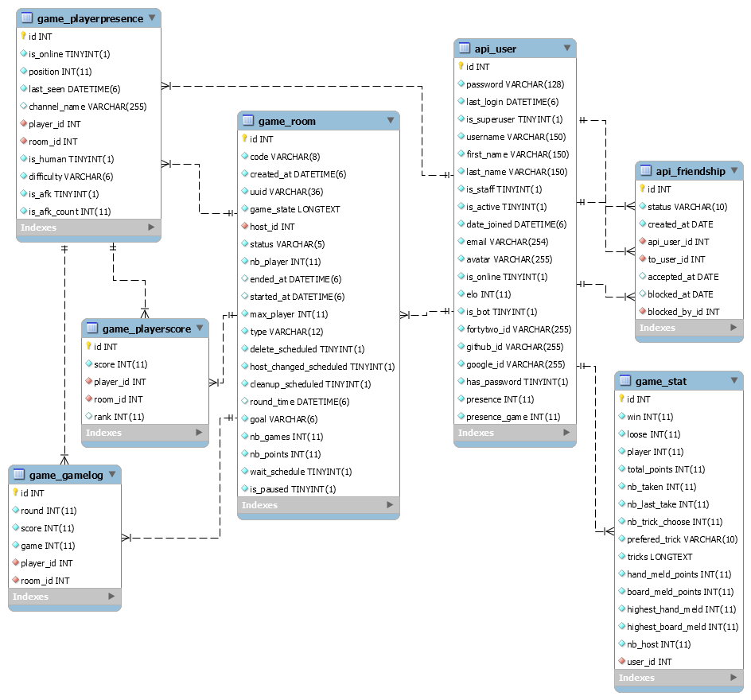

_This project has been created as a part of the 42 curriculum by cgoldens, atomasi, ktintim-, dvauthey, and akabbaj_

# Transcendence

## Description

### Overview
Transcendence is the final project of the Ecole 42 common core. It is a project for students to not only show what they have learnt, but also to demonstrate their ability to learn, adapt, and implement new skills.

As such, the subject for Transcendence gives students the freedom to create an original project, while validating their choice of modules from a selection provided.

### Popcards
The Popcode team has been together since the beginning of their 42 journey. What started as just a daily lunch between students has since become a tight-nit team. 

Throughout our journey at 42 we've gone from sharing lunch, to playing cards, to working together. As we worked together, a tradition of sharing popcorn emerged hence, our team name and the essence of our website.

Popcards is the product of the Popcode team. It is an online platform to play a card game known as "La Misère", as Swiss card game which became a favourite for our team's lunchtime entertainment.

The following features are implemented on Popcards:
- Account creation (necessary to access many of the website's features)
	- OAuth login for: Google, Github, 42
- Friends management
	- Friend requests
	- Friend deletion
	- blocking/unblocking users
- Realtime updates/notifications
	- Realtime online/offline status changes for friends
	- Notifications of events such as friend requests, game invites, game information
	- Realtime leaderboard updates
	- Realtime updates to friend lists
- The game
	- Join/Create Rooms
	- Private/Public/Friend only rooms
	- Friend invites
	- Modify game settings
	- Add bots to games
	- Elo tracking system
	- In game chat


## Instructions

### Prerequisites
- Docker and Docker Compose (v2+)
- Git
- Make
- A secrets folder in `./srcs` containing:
	- `.env` - Please see .env.example for further guidance
	- `django_secret.txt` - Must have a key for django, this can be anything although it is recommended you generate a key using: @Cyril


	- The following secret files must be non-empty. If they contain valid API Secret Keys that correspond to the IDs provided in the .env they will allow OAuth login for their corresponding service.
		- `google_secret.txt`
		- `git_secret.txt`
		- `42_secret.txt`
- To create valid OAuth clients please follow the instructions provided by the related services in order to create a valid client. Once created you will be able to subsitute the correct values in the .env and secret files.
- For SELinux users there may be additional requirements. Please see below.

### Setup
1. Clone the repository:
``` bash
git clone https://github.com/Cyraullie/transcendence.git
cd transcendence
```
2. Build and start all services:
``` bash
make prod
```
This will build the project in docker compose, using the self-signed SSL certificates provided, and start all docker containers.

3. The application will be available at `https://localhost:{NGINX_PORT}` (NGINX_PORT specified in .env, for a normal production version 443 is recommended).
4. For developper features such as clearing the DBs, run `make` to see all commands available.

### Makefile usage

### SELinux

Certain users with operating systems which use SELinux may run into permissions issues when running the Docker containers. To solve this our recommended solution is to modify the `docker-compose.yml` file, or create a new one.

A template has been provided for this file. The key changes are: `:Z` has been added to bind mounted volumes. Secrets have been converted to bind mounted volumes to allow for this.

We did not use this as our default `docker-compose.yml` as we preferred to implement docker secrets in a clean way as intended, rather than reproducing their behaviour with bind mounts.

There is also a "quick and dirty" method to solve this issue, however it is not a best practice and is not endorsed by the Popcode team. This method **which should only be used for development with permission from your administrator** is to disable SELinux specifically for the docker service. As it is not recommended we will not be providing information on how to do this. 😉


## Team Information

| Login | Name | Role(s) | Description |
| --- | --- | --- | --- |
| cgoldens | Cyril Goldenschue | Tech Lead, Developer | Defined the technical architecture of the project, with a focus on the backend and database. |
| atomasi | Alexandre Tomasi | Product Owner, Developer | Led the definition of the product visions, and discussions on feature implementation. |
| ktintim- | Kilian Tintim | Happiness Manager, Developer | Supported the Tech Lead in developing the technical architecture. Kept everyone smiling. |
| dvauthey | Dana Vauthey | Art Director, Developer | Defined the artistic vision of the project. Supported the Product Owner to maintain a consistent product. |
| akabbaj | Anouar Kabbaj | Project Manager, Developer | Supported coordination between frontend and backend. Helped organise team meetings. |

## Project Management

### Organisation
The project was divided into 3 core components. These components were then further subdivided to allow for proper work distribution.
- **Frontend & UI/UX**
	- **Artistic Direction**: Dana took the lead, painstakingly creating the visual assets to be used for the game. Alex collaborated with Dana to create a cohesive style for the application.

	- **UI/UX**: Alex managed the implementation of the React frontend, using technologies such as CSS and typescript. Dana then joined to further assist with the web development in particular with the implementation of the game.

	- **API Connectivity**: Once there was an established structure for the website, Anouar managed connections between the React frontend and the Django backend. First HTTP requests were implemented, then websockets.

- **Backend**
	- **Database management**: Cyril implemented the MariaDB database, ensuring connectivity with the Django backend.

	- **API**: Cyril managed the API from the backend, providing the frontend with structured information from the database. This also included securing endpoints to ensure safe access to the API. Kilian provided support by testing API access, in particular in relation to the game. Websockets were also implemented by Cyril throughout to provide seamless realtime information to the application. Anouar implemented OAuth for Google, Git, and 42.

	- **Game Engine**: Kilian created the game engine, allowing for a game that follows real world rules, while being adaptle to user specifications. This included a scoring system, elo system, and allows for the use of bots with different difficulty levels. The game was then connected to websockets allowing for connectivity to the frontend.

- **DevOps**

	- **Docker & Make**: Initially handled by Cyril, a structure for containerization and deployment was created. Further on in the project Anouar enhanced the structure for a production-ready setup.

The team collaborated by having initial meetings to decide on the general direction for the project. Within subteams further meetings were held when needed. As the project continued there were meetings every 1-2 weeks to ensure the whole team was on the same page. The team largely worked on-site together allowing for regular informal discussions, enhancing cohesion both within team dynamics and for a better overall vision of the project. 


### Tools
- **Version control**: Github
- **Task tracking & resource sharing**: Notion
- **Communication Channels**: Discord, Whatsapp


## Technical Stack

### Frontend
- **React + TypeScript**: Being a commonly used framework + language which some team members already had experience with, we felt it would benefit our project to use them. The layout and structure of code and design that is encouraged by these technologies suited our approach to the design of our project.
- **Tailwind CSS**: The ease of integration between CSS and React allowed for both more writeable and readable code, allowing for more effective teamwork. 
- **WebSockets**: As opposed to HTTP requests WebSockets allowed for continuous communication between the frontend and backend. This allowed for seamless real-time interactions between users, notably when in game.
- **ThreeJS**:
- **DaisyUI**: DaisyUI provided an easily accessible library of components that were readily customisable making it an obvious choice for our project especially as it provided a foundation that was already in line with our design principles.

### Backend

- **Django**: A high-level Python web framework that enables rapid development of secure, scalable, and maintainable web applications. It provides built-in features such as an ORM, authentication system, administration panel, URL routing, and more.

- **Django REST Framework (DRF)**: An extension of Django used to build RESTful APIs. It provides tools for data serialization, authentication, permissions, pagination, and API view management.

- **Daphne**: An ASGI server designed to run asynchronous Django applications. It supports WebSockets through Django Channels, enabling real-time communication between clients and the server.

- **Celery**: A distributed task queue used to execute asynchronous and scheduled background tasks. It helps offload time-consuming operations such as sending emails, processing data, and running periodic jobs without blocking user requests.

### Database

- **MariaDB**: An open-source relational database management system (RDBMS) compatible with MySQL. It is used to store, manage, and query application data efficiently and reliably.

### Real-Time Communication

- **Django Channels**: An extension for Django that adds support for asynchronous protocols such as WebSockets. It enables real-time features like live notifications, chat systems, and multiplayer interactions.

- **Redis**: An in-memory data store commonly used as a message broker for Celery and as the channel layer backend for Django Channels. It provides fast data access and efficient communication between services.

### Infrastructure
- **Docker + Docker Compose**: Docker was already well known to our team, and allowed for us to easily deploy standardized containers from different environments and ensure efficient internal communication between them.
- **NGINX**: NGINX provides a simple and easy to use webserver which integrated well with our docker containers, and allowed for simple integration with cloudflare tunnels to host our project in the future.

### Other
Procreate


Frontend technologies and frameworks used.
◦ Backend technologies and frameworks used.
◦ Database system and why it was chosen.
◦ Any other significant technologies or libraries.
◦ Justification for major technical choices.


## Database Schema




## Features List

| Feature | Description | Implemented by |
| --- | --- | --- |
| User Authentication | Users are able to login and/or register to the website using usernames and passwords which are validated by both the front and backend. Credentials are stored securely on the backend. | Cyril, Alex, Anouar |
| Cookie-based JWT Authentication and OAuth | Once authenticated JWT access and refresh tokens are generated for the user. These are stored as cookies on the frontend. Users can also login via OAuth creating similar JWT tokens which are also stored in cookies. | Cyril, Anouar |
| Modifiable Site Settings | Users are able to choose between fonts and dark or light mode. | Alex |
| User Profiles | Users can access their profiles which store: username, avatar, friends, match histories and statistics. | Cyril, Alex, Dana, Anouar |
| Friend Management | Users can send and receive friend requests, remove friends, block other users, and invite friends to games. | Cyril, Alex, Dana, Anouar |
| Blocked Users Management | Blocked users will not be able to see the profiles of users they have blocked/been blocked by. They can unblock users via the settings page. | Cyril, Alex, Anouar |
| Leaderboard, Statistics & Game History | Various information regarding previously played games is stored on the backend. Users can see this information, with some of it being restricted to friends only. | Everyone |
| Realtime Updates & Notifications | Via WebSockets users can receive notifications of incoming friend requests in real-time. Certain fields are also updated in real-time with requiring interaction from the user. | Cyril, Alex, Anouar |
| Handmade custom cards | All the game assets have been created by hand. | Dana |
| Custom Game Engine | The game engine is able to run games  of “La Misère” | Kilian |
| AI Opponents | AI opponents can be added as players to a match as well as replace players who are AFK. The opponents can have varying difficulty levels. | Kilian |
| Customizable Matches | Matches can be customized for duration (amount of points or games), player limit, privacy and amount of bots. | Cyril, Kilian |
| Real-time Multiplayer | Using WebSockets players are able to see each others actions in real-time, as well as chat with each other in an in game chat. | Cyril, Kilian, Anouar |
| Game Lobbies | Before a game starts players will be put into a lobby where they can see the other players and can see the game settings in real-time as they are set by the host. | Everyone |
| Remote Players | Players can play the game from different machines and networks (provided the server is hosted). | Cyril, Kilian, Anouar |
| In-game Chat | Players can chat with each other while in game. | Kilian, Dana |

## Modules

### Web

| Module | Type | Points | Implementation/Justification | Implemented by |
| --- | --- | --- | --- | --- |
| Use a frontend framework | Minor | 1 | React was used to allow for seamless creation and implementation of components using TypeScript and CSS. | Alex, Dana, Anouar |
| Use a backend framework | Minor | 1 | Django was used to have a foundation of already working web development features allowing for our team to focus on the unique aspects of our Web Application. | Cyril, Kilian |
| Implement real-time features using Websockets | Major | 2 | WebSockets were used to allow for real-time communication between users and the server. This allowed for a live multiplayer game, an in game chat, and real-time notifications. | Cyril, Anouar |
| Allow users to interact with other users. | Major | 2 | Users are able to see other users’ profiles, send and receive friend requests, block users, and play games with each other. This provides a fully developed user experience. | Cyril, Alex, Dana, Anouar |
| Use an ORM for the database | Minor | 1 | Django’s capability as an ORM was used to allow database information to be easily created and accessed without having to use SQL in our program. | Cyril |
| Custom-made design system | Minor | 1 | A custom design system based on DaisyUI was made to give the website a cohesive feel and improve aesthetics. | Alex, Dana |
| Implement advanced search functionality | Minor | 1 | Users are able to search through other users in the database to add new friends, additionally game lobbies can be filtered. This improves the quality of life of a user. | Alex |


### Accessibility

| Module | Type | Points | Implementation/Justification | Implemented by |
| --- | --- | --- | --- | --- |
| Support for additional browsers | Minor | 1 | Our web application is compatible with Firefox, Chrome, and Safari allowing for various users to use our platform. The use of standardized frameworks allowed for maximum compatibility. | Everyone |


### User Management


| Module | Type | Points | Implementation/Justification | Implemented by |
| --- | --- | --- | --- | --- |
| Standard user management and authentication | Major | 2 | Users are able to create accounts, log in, and stay logged in even when leaving the website through use of JWT tokens and Cookies. | Cyril, Alex, Anouar |
| Game statistics and match history | Minor | 1 | Users can see their own statistics, and match history, as well as the match history of their friends. Additionally a public leaderboard with ranking is available. | Cyril, Alex, Kilian, Dana |
| Implement remote authentication with OAuth 2.0 | Minor | 1 | We have implemented OAuth 2.0 allowing for login via Google, Github, and 42 Intra. This makes logging in a seamless experience, and users with existing accounts can connect their accounts to OAuth should they share the same email. | Anouar |


### Artificial Intelligence

| Module | Type | Points | Implementation/Justification | Implemented by |
| --- | --- | --- | --- | --- |
| Introduce an AI Opponent for games | Major | 2 | AI opponents of 3 different levels can be added to games. These opponents can be added at the start or can replace players who disconnect. | Kilian |

### Gaming and User Experience

| Module | Type | Points | Implementation/Justification | Implemented by |
| --- | --- | --- | --- | --- |
| Implement a complete web-based game | Major | 2 | “La Misère” has been implemented, allowing users to play cards with other users and bots. | Everyone |
| Remote players | Major | 2 | Players from different machines can all connect to the same lobbies. Additionally if the server is hosted players can join from different networks. | Cyril, Kilian |
| Multiplayer game | Major | 2 | The game is fully multiplayer between both real players and bots. | Cyril, Kilian |
| Implement advanced 3D graphics | Major | 2 | ThreeJS was used to implement real-time 3D graphics which accurately reflect the game state. | Alex, Dana |

### Other

| Module | Type | Points | Implementation/Justification | Implemented by |
| --- | --- | --- | --- | --- |
| Create fully customized in-game assets | Minor | 1 | All game assets were created by hand creating a unique feel and experience for the website. | Dana |


## Individual Contributions

### Cyril Goldenschue

Features Implemented

- Game WebSocket
- Presence Websocket
- Notification Websocket
- Connection to game engine from game Websocket
- Many route api to get stats, friends, users and room informations

Challenges

- Understanding the specificities of Django
- Understansing the specificites of Websocket
- Connection game engine to game Websocket

### Alexandre Tomasi

Features Implemented

- Creation of the UX architecture
- Creation of the Profile Page
- Creation of the Leaderboard page
- Creation of the game lobby page
- Creation of parts of the in game interface
- Handled interactions with cards in hand and animations

Challenges

- Learning to use ThreeJS
- Working and collaborating with others
- Compromising with other team members
- Working in a way which allows the whole team to keep moving forwards
- Working simultaneously with varied services
- Putting self in the state of mind of the end user


### Kilian Tintim

Features Implemented

- Custom game engine
- AI Opponents of different levels
- In game chat using WebSockets
- Management of the game state on the backend

Challenges

- Accepting to work with Python
- Understanding the specificities of Django
- Refactoring code when required by changes to the database or the existing codebase
- Remembering to use await before asynchronous functions

### Dana Vauthey

### Anouar Kabbaj

Features Implemented

- OAuth 2.0
- API Connections from on the frontend
- Realtime updates and notifications using websockets
- Online offline detection in backend websockets
- Cookie management in front end backend
- Logic for front with logged in states and game states
- Connection of the game from the frontend to the backend
- Devops docker and makefile
- Readme

Challenges:

- Being absent/catching up due to illness
- Being inbetween the frontend and backend communication and standardization posed some issues
- With some team members having SELinux activated there were compatibility issues to deal with.
- Refactors across back and front when changes to DB information or cookies etc.

## Resources

### **Frontend**

- [French language nodeJS tutorial](https://www.youtube.com/watch?v=0PA69L88HeI&list=PLjwdMgw5TTLV7VsXd9NOeq39soYXORezN)
- https://www.docker.com/blog/how-to-dockerize-react-app/
- https://react.dev/learn
- https://r3f.docs.pmnd.rs/getting-started/introduction
- https://r3f.docs.pmnd.rs/getting-started/your-first-scene
- https://r3f.docs.pmnd.rs/getting-started/examples
- https://threejs.org/docs/
- [WebGL, Three.js and React tutorial](https://www.youtube.com/watch?v=P-U9SJ3kaMI&list=TLPQMjAwNDIwMjYx4pN486UWjw&index=5)
- [Workaround to install daisyui](https://github.com/tailwindlabs/tailwindcss/issues/19950)
- https://www.react-spring.dev/
- https://www.typescriptlang.org/docs/handbook
- https://www.typescriptlang.org/docs/handbook/2/classes.html
- [How flip a card](https://www.youtube.com/watch?v=P-U9SJ3kaMI&list=TLPQMjAwNDIwMjYx4pN486UWjw&index=5)
- [How to organize CSS](https://www.youtube.com/watch?v=P-U9SJ3kaMI&list=TLPQMjAwNDIwMjYx4pN486UWjw&index=5)

### **Backend**

- https://www.djangoproject.com/download/
- [Django Explained](https://www.youtube.com/watch?v=P-U9SJ3kaMI&list=TLPQMjAwNDIwMjYx4pN486UWjw&index=5)
- [Learn Django](https://www.youtube.com/watch?v=P-U9SJ3kaMI&list=TLPQMjAwNDIwMjYx4pN486UWjw&index=5)
- https://www.geeksforgeeks.org/python/class-based-generic-views-django-create-retrieve-update-delete/
- https://medium.com/@michal.drozdze/setting-up-a-django-api-with-django-rest-framework-drf-a-beginners-guide-cee5d61f00a6
- https://www.docker.com/blog/how-to-dockerize-django-app/
- https://www.pythonmorsels.com/every-dunder-method/
- https://docs.astral.sh/ruff/
- https://docs.astral.sh/uv/
- https://medium.com/django-unleashed/websockets-based-apis-with-django-real-time-communication-made-easy-2122b49720bf
- https://www.freecodecamp.org/news/how-to-enable-cors-in-django/
- https://gist.github.com/J-Priebe/58fda441698536d64e04781d9214e1db

## AI Usage

- Helped to break down complicated concepts
- Acted as a soundboard for ideas
- Helped debugging complex errors
- Helped understanding others’ code
- Assisted in coming up with specific tests
- Clarified concepts from research materials
- Created some code for repetitive functions (thoroughly checked by humans)
- Was NOT used for this delightful readme that I made by hand
